# easyPOI

## 导出word

使用easyPOI方式导出word文档，Word模板和Excel模板用法基本一致，支持的标签也是一致的，仅仅支持07版本的word也是只能生成后缀是docx的文档，poi对doc支持不好所以easyPOI中就没有支持doc


EasyPoi支持的指令以及作用：

```properties
三元运算 {{test ? obj:obj2}}
n: 表示 这个cell是数值类型 {{n:}}
le: 代表长度{{le:()}} 在if/else 运用{{le:() > 8 ? obj1 : obj2}}
fd: 格式化时间 {{fd:(obj;yyyy-MM-dd)}}
fn: 格式化数字 {{fn:(obj;###.00)}}
fe: 遍历数据,创建row
!fe: 遍历数据不创建row
$fe: 下移插入,把当前行,下面的行全部下移.size()行,然后插入
#fe: 横向遍历
v_fe: 横向遍历值
!if: 删除当前列 {{!if:(test)}}
单引号表示常量值 ‘’ 比如’1’ 那么输出的就是 1
&NULL& 空格
&INDEX& 表示循环中的序号,自动添加
]] 换行符 多行遍历导出
sum： 统计数据
```


准备一个模板：

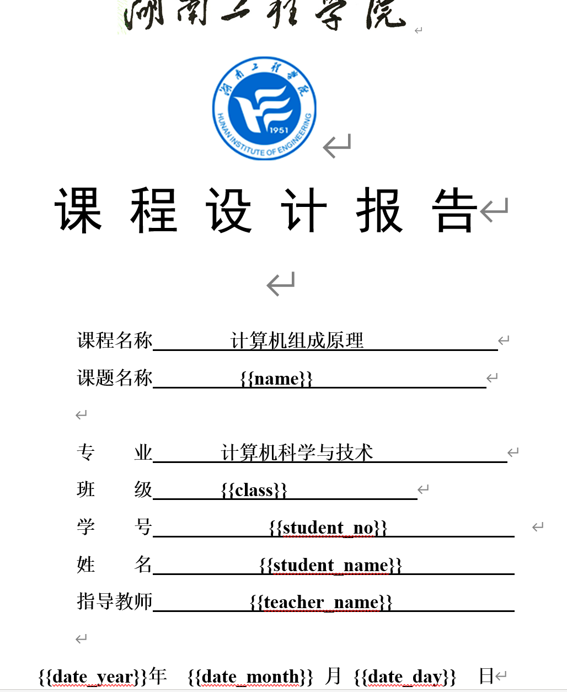


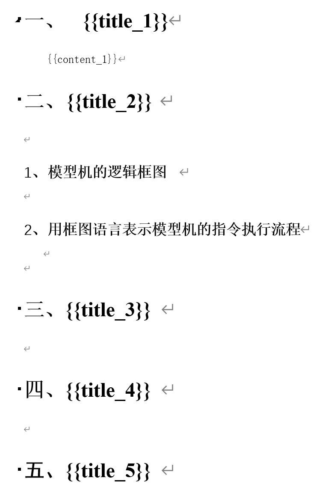


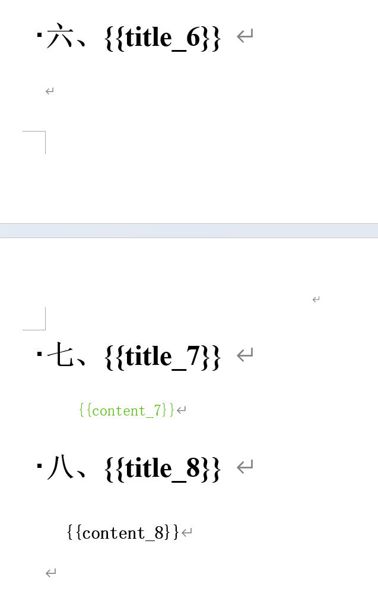


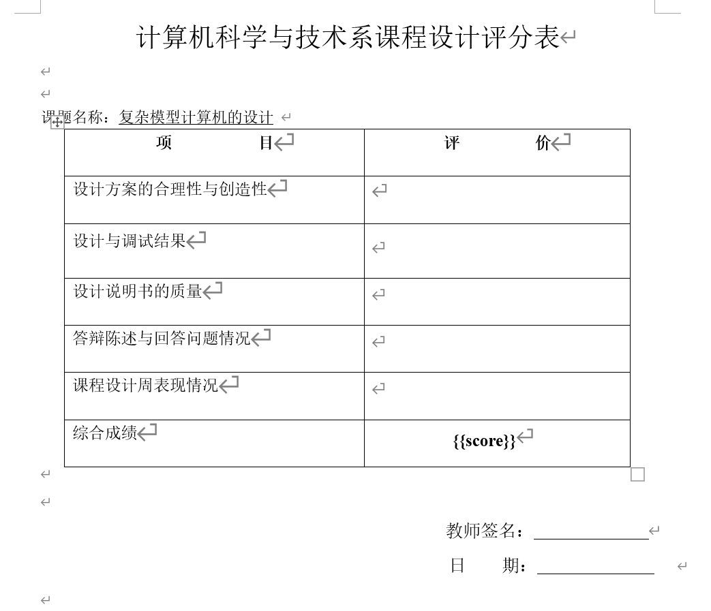


编写代码：

```java
package mao;

import cn.afterturn.easypoi.word.WordExportUtil;
import org.apache.poi.xwpf.usermodel.XWPFDocument;

import java.io.FileOutputStream;
import java.time.LocalDate;
import java.util.HashMap;
import java.util.Map;

/**
 * Project name(项目名称)：java报表_EasyPOI导出word
 * Package(包名): mao
 * Class(类名): Test1
 * Author(作者）: mao
 * Author QQ：1296193245
 * GitHub：https://github.com/maomao124/
 * Date(创建日期)： 2023/6/7
 * Time(创建时间)： 15:15
 * Version(版本): 1.0
 * Description(描述)： 无
 */

public class Test1
{
    public static void main(String[] args) throws Exception
    {
        //数据
        Map<String, Object> params = new HashMap<>();
        params.put("name", "复杂模型计算机的设计");
        params.put("class", "计算机科学与技术1班");
        params.put("student_no", "123454678945");
        params.put("student_name", "mao");
        params.put("teacher_name", "张三");
        params.put("date_year", LocalDate.now().getYear());
        params.put("date_month", LocalDate.now().getMonthValue());
        params.put("date_day", LocalDate.now().getDayOfMonth());
        params.put("title_1", "课题的主要功能");
        params.put("content_1", "本课题是.........");
        params.put("title_2", "总体设计方案");
        params.put("title_3", "数据格式和寻址方式的设计");
        params.put("title_4", "指令和微程序的设计");
        params.put("title_5", "线路连接图");
        params.put("title_6", "微程序流程及说明");
        params.put("title_7", "课程设计的收获及体会");
        params.put("content_7", "计算机的教学是让学生学习电脑的使用方法，了解电脑对于我们学习和工作的重要性，" +
                "以及利用不同的软件达到我们初始的目的。这其实也让我们通过不同的教学方式，不同的教学思维让学生对于电脑学习的兴趣，" +
                "尤其是使用电脑并不仅仅只是来查资料或者是打游戏，还有其他很多很多的东西可以学习，" +
                "我们要正确引导学生对于计算机的学习，让他们明白更多的学习方法以及计算机知识。\n" +
                "\n" +
                "　　计算机能够做的东西有很多，我们要用到的地方也很多，在这样的情况下，给同学们上好课，" +
                "引起他们的兴趣，第一堂课很重要。第一次讲述计算机相关的内容，应该提前备好课，将文字和图片有机的结合到一起，" +
                "将学习的内容尽可能的让其生动起来，勾起学生对计算机学习的兴趣。因为书本的上面的知识到底和计算机上面的画面不一样，" +
                "学生对于动静结合的画面更加感兴趣一点，同时对于这样的知识也更加容易吸收一点，因此在之后的学习上也更加的期待。");
        params.put("title_8", "参考资料");
        params.put("content_8", "暂时无参考资料");

        params.put("score", "100");

        //写入
        XWPFDocument xwpfDocument = WordExportUtil.exportWord07("./template.docx", params);
        FileOutputStream fileOutputStream = new FileOutputStream("out.docx");
        xwpfDocument.write(fileOutputStream);
        xwpfDocument.close();
        xwpfDocument.close();

    }
}
```


运行：

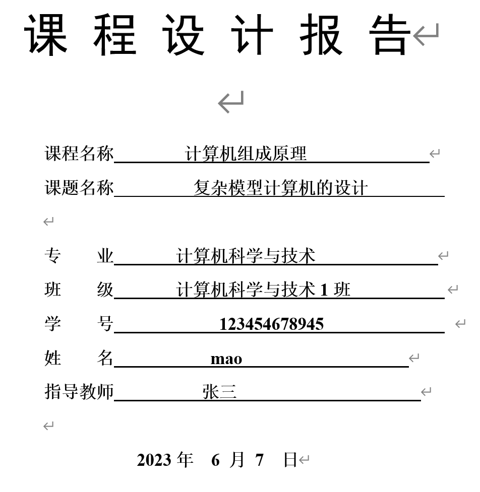


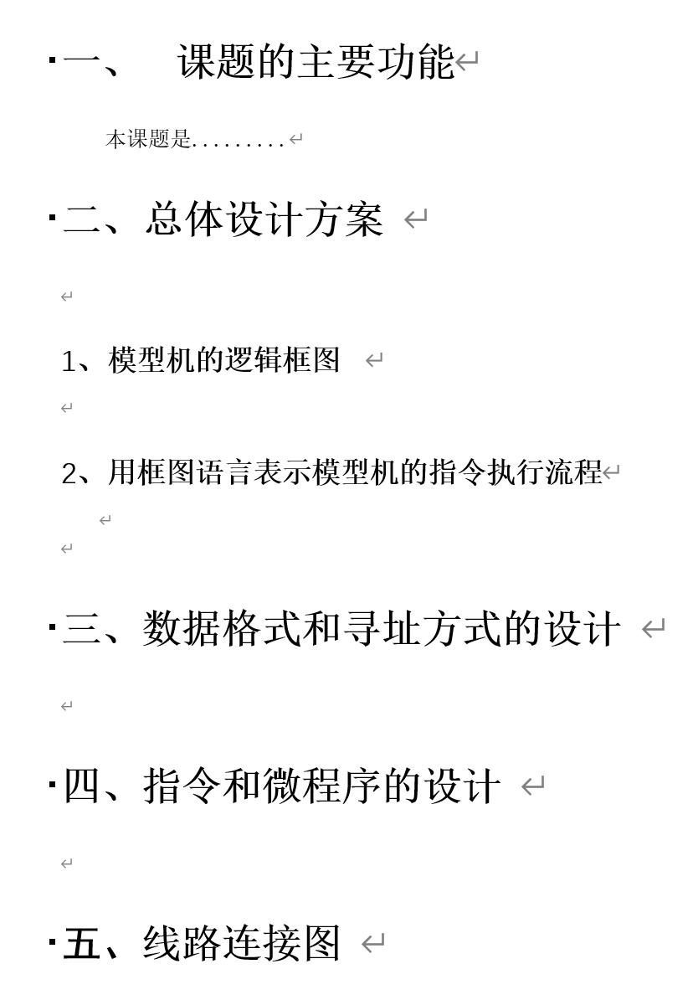


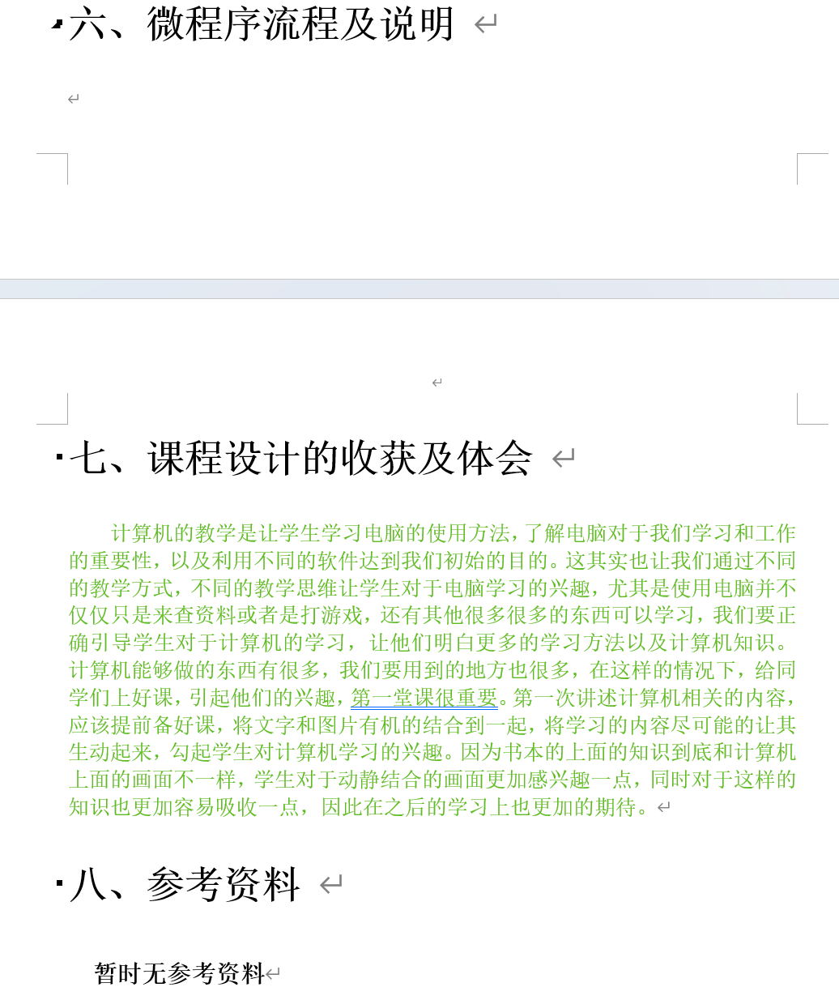


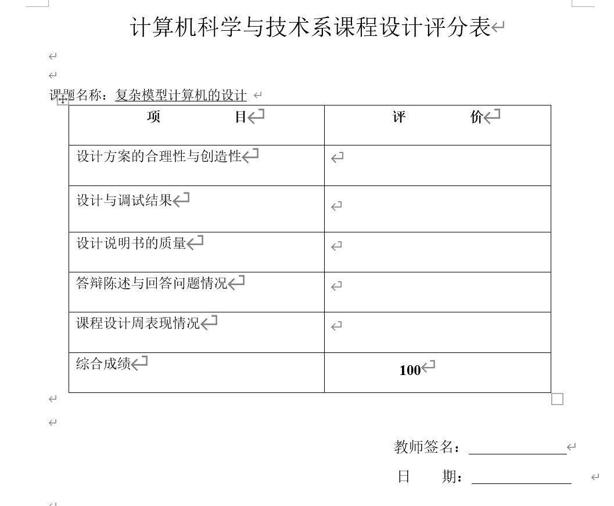


准备一个表格模板：

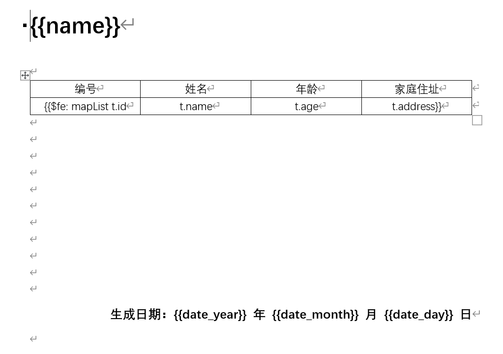


代码：

```java
package mao;

import cn.afterturn.easypoi.word.WordExportUtil;
import org.apache.poi.xwpf.usermodel.XWPFDocument;

import java.io.FileOutputStream;
import java.time.LocalDate;
import java.util.ArrayList;
import java.util.HashMap;
import java.util.List;
import java.util.Map;

/**
 * Project name(项目名称)：java报表_EasyPOI导出word
 * Package(包名): mao
 * Class(类名): Test2
 * Author(作者）: mao
 * Author QQ：1296193245
 * GitHub：https://github.com/maomao124/
 * Date(创建日期)： 2023/6/7
 * Time(创建时间)： 16:14
 * Version(版本): 1.0
 * Description(描述)： 无
 */

public class Test2
{
    /**
     * 得到int随机
     *
     * @param min 最小值
     * @param max 最大值
     * @return int
     */
    public static int getIntRandom(int min, int max)
    {
        if (min > max)
        {
            min = max;
        }
        return min + (int) (Math.random() * (max - min + 1));
    }

    public static void main(String[] args) throws Exception
    {
        //数据
        Map<String, Object> params = new HashMap<>();
        params.put("name", "员工信息表");

        //下面是表格中需要的数据
        List<Map<String, Object>> mapList = new ArrayList<>();
        Map<String, Object> map = null;
        for (int i = 1; i <= 180; i++)
        {
            map = new HashMap<>();
            map.put("id", i);
            map.put("name", "姓名" + i);
            map.put("age", getIntRandom(15, 30));
            map.put("address", "中国");
            mapList.add(map);
        }
        //把组建好的表格需要的数据放到大map中
        params.put("mapList", mapList);

        params.put("date_year", LocalDate.now().getYear());
        params.put("date_month", LocalDate.now().getMonthValue());
        params.put("date_day", LocalDate.now().getDayOfMonth());

        //写入
        XWPFDocument xwpfDocument = WordExportUtil.exportWord07("./template2.docx", params);
        FileOutputStream fileOutputStream = new FileOutputStream("out2.docx");
        xwpfDocument.write(fileOutputStream);
        xwpfDocument.close();
        xwpfDocument.close();

    }
}
```


效果：

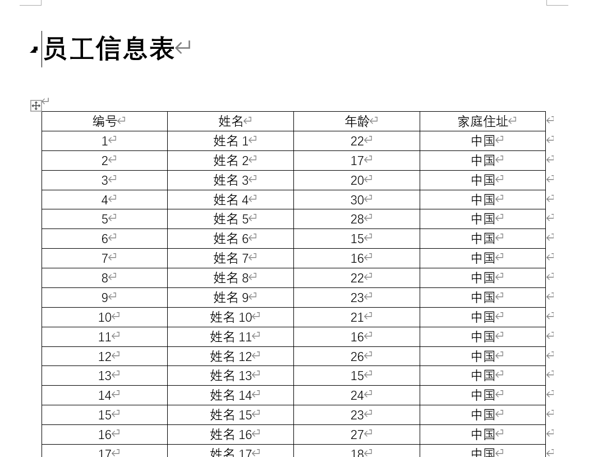


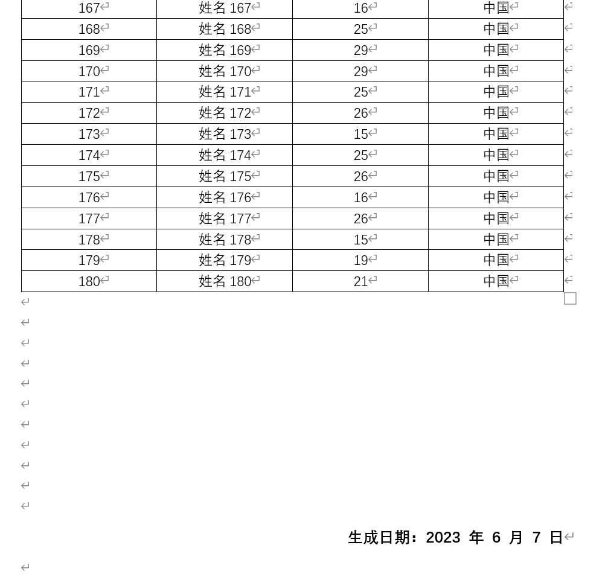


